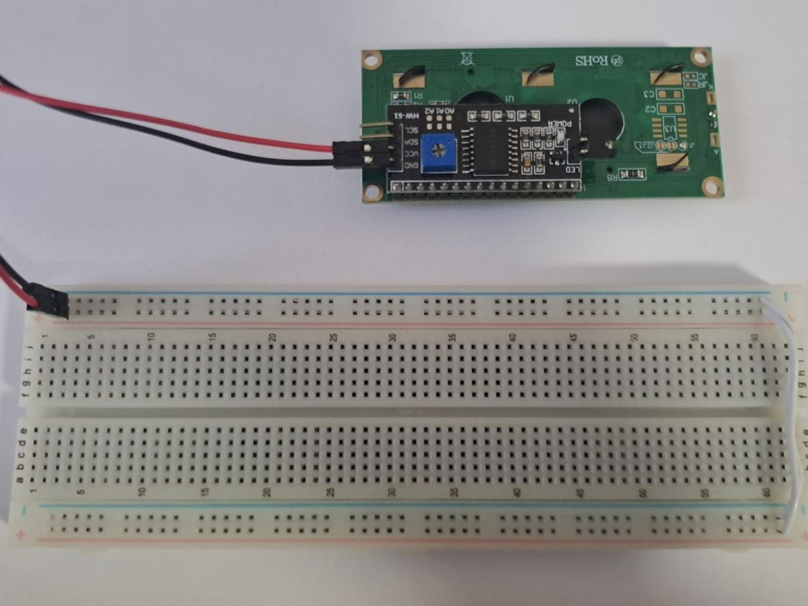
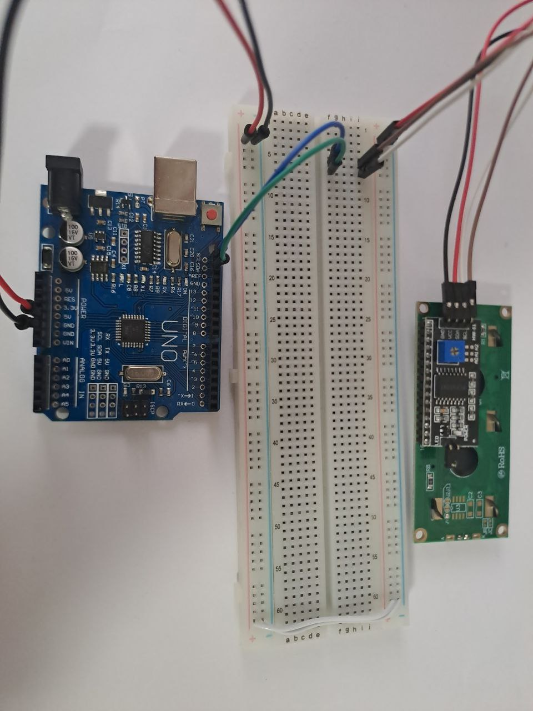
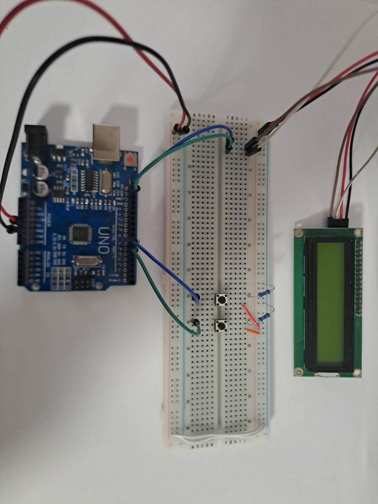

# Arduino calculator

Simple calculator made for arduino that uses LCD display.

## Componens

- An arduino (i used arduino uno)
- LCD display with i2c module (16x2 or 20x4 should work)
- 2 buttons or some other input component like a switch
- 2 10k resistors (if you are using buttons)
- other stuff like breadboard and wires

## Instructons

1) Upload this program through arduino IDE onto your arduino.
2) Connect i2c GND to - and VCC to + on your breadboard.
(i2c module should be already connected to your LCD screen)

    

3) Connect arduino 5v pin to - and GND pin to + on a bread board.
(make sure they connect with i2c)
4) Connect i2c SDA to arduino SDA pin and connect i2c SCL to arduino
SCL pin.

    

5) Connect 2 buttons to pin 7 & 6
(connect to pin on 1 side and on the other connect 10k resistor
oposite to pin connection and second to +)

    

6) Connect arduino to power and enjoy!

## Usage

Button connected to pin 7 is button A, the once connected to pin 6 is
button B.

Pess button A to chose next option. Press button B to chose current option.

'=' option will calculate result and print it. '<' option will
delete last character. Any other option will add corresponding
character to expression.